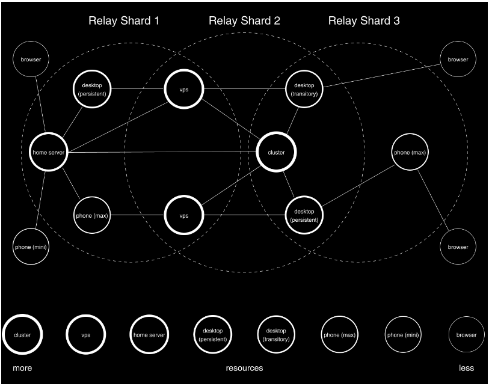
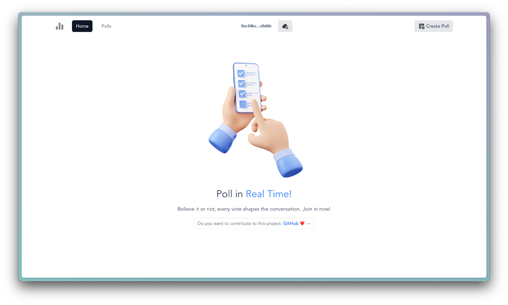
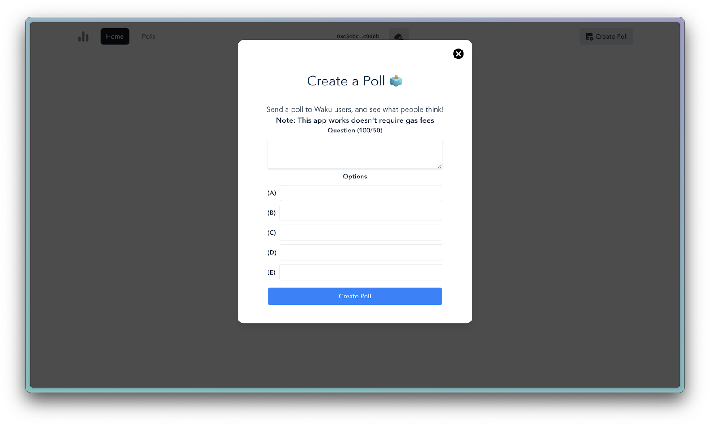
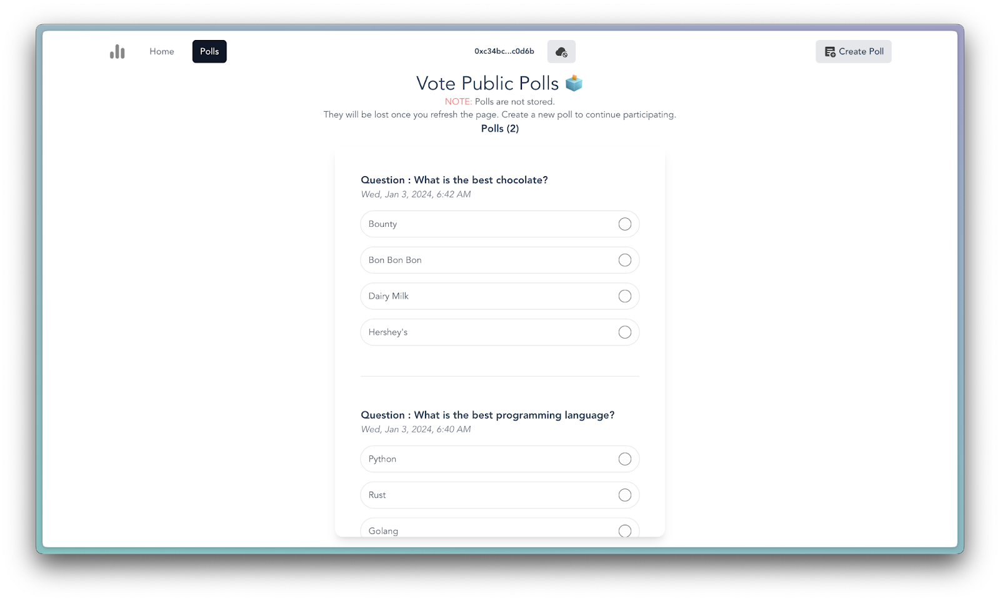

# Build a dApp Using Waku (Decentralized Communication) and Vue.js
 and Vue.js.png>)

Hi, frens 👋!

### TL;DR
Did you know that far beyond being a mere industry buzzword, decentralized communication represents a strategic response to the vulnerabilities inherent in centralized systems? It prioritizes privacy, security, and censorship resistance, making it an indispensable component in web developers' toolkits.

Traditional centralized communication systems have long struggled with censorship, single points of failure, and privacy concerns. With the rise of Web 3 and blockchain technology, decentralized communication solutions like Waku are emerging as a promising alternative. Waku offers a peer-to-peer (P2P) messaging system that is resilient to censorship, scalable, and secure, making it an ideal choice for dApp developers looking to build next-generation applications.

This article will guide you on how to build a decentralized application (dApp) using Waku, an uncompromising decentralized communication protocol, and Vue.js, a popular JavaScript framework for building user interfaces. Before diving into the hands-on development aspects of this article, it is recommended that you have a basic understanding of Vue.js, familiarity with Tailwind CSS for UI styling, and a grasp of web3.js for seamless wallet integration.   

> If these technologies are new to you, no problem – this guide is meticulously created for all levels of expertise, providing step-by-step guidance at every level.
>
> And don't forget to drop a "💖🦄🔥🙌🤯".

## Understanding Waku
Waku is a collection of decentralized peer-to-peer messaging protocols that enable secure and censorship-resistant communication over a decentralized network. Its features include end-to-end encryption, persistent/ephemeral messaging, and efficient peer discovery, providing a foundation for secure and reliable communication.

Waku operates within a peer-to-peer topology, creating a decentralized network that thwarts censorship and provides surveillance resistance. Its design supports scalability, with the ability to accommodate millions of users. It is designed to be the successor of Whisper, the messaging layer of the Ethereum blockchain P2P protocol suite, and outperforms it in scalability and resource efficiency.

Waku's architecture is underpinned by three distinct network interaction domains: gossip, discovery, and request/response. Although Waku is a cohesive whole in terms of capabilities, it encompasses three primary clients designed for different environments and several SDKs, including Rust, React Native, Kotlin, and Swift.
1. **nwaku:** The reference implementation in Nim.
2. **go-waku:** Tailored for native integration with Golang applications.
3. **js-waku:** A JavaScript implementation optimized for browser environments.
    
Waku consists of multiple protocols, each serving a specific function within the network. They include, but are not limited to:
* **Waku Relay:** The backbone of the Waku network, employing a pub/sub approach to peer-to-peer messaging. Emphasizes privacy, censorship resistance, and security, extending the libp2p GossipSub protocol.
* **Waku Filter:** A lightweight version of the relay protocol designed for resource-restricted devices. Allows light nodes to receive specific messages of interest from full nodes.
* **Waku Store:** Facilitates message retrieval for devices unable to participate in the Waku Relay network while offline.
* **Waku Light Push:** A request/response protocol enabling nodes with short connection windows or limited bandwidth to publish messages to the Waku network.



Understanding Waku's architecture and protocols lays the groundwork for proceeding into practical implementations.

## Use Cases of Waku
Waku's versatile architecture and capabilities find relevance in a myriad of real-world scenarios where secure and decentralized communication is paramount. Whether it's facilitating private conversations between users, enabling data exchange between devices, or supporting communication among nodes within a network, Waku emerges as a robust solution.

#### Privacy-focused Communication
Waku's emphasis on privacy makes it an ideal choice for scenarios where safeguarding user information is of utmost importance. In applications dealing with sensitive data or confidential conversations, Waku's end-to-end encryption and decentralized architecture provide a secure environment, mitigating the risks associated with centralized communication platforms.

#### Censorship-resistant Messaging
Waku offers a beacon of hope for unrestricted communication in regions where internet censorship is prevalent. Its peer-to-peer topology prevents centralized authorities from controlling or monitoring messaging traffic, ensuring that users can communicate freely without fear of censorship. This makes Waku particularly valuable in promoting freedom of expression and supporting open communication channels.

#### Use in dApps for Decentralized Communication
Decentralized Applications (dApps) form a burgeoning ecosystem where Waku can play a pivotal role. Waku's integration into dApps enhances communication functionalities, enabling real-time interactions among users while maintaining the decentralized ethos. This proves particularly valuable in scenarios such as collaborative platforms, social networks, or any application where user engagement and communication are central components.

By exploring the features and capabilities of Waku, it becomes evident that Waku's applicability extends beyond theoretical advantages, finding practical application in diverse areas.

## Building a dApp with Waku and Vue.js
Polling systems often face challenges related to centralization, privacy concerns, and susceptibility to manipulation. By integrating Waku and Vue.js, we can tackle these challenges, creating a decentralized voting poll application that leverages the power of peer-to-peer communication.

Here is the entire source code of my voting poll app on GitHub: [https://github.com/wolz-CODElife/waku-vue-poll.git](https://github.com/wolz-CODElife/waku-vue-poll.git) and the [live application](https://waku-vue-poll.vercel.app/) is hosted on Vercel.







### Dev Tools I Used?
* **Vite**: To bootstrap the Vue3 application with the Tailwind template.
* **Vue 3**: To build the user interface.
* **TypeScript**: For type safety and potential for catching errors during compiling.
* **Tailwind CSS**: For styling the user interface.
* **Web3.js**: For implementing wallet connect.
* **Node Polyfill Webpack Plugin**: For providing polyfills necessary for emitting Web3.js events in the browser. Since Vue3 uses webpack v5, where polyfill Node core modules were removed.
* **Crypto Hash**: For hashing user address, where wallet is not available.
* **Protobufjs**: For serializing message data sent through Waku.
* `@waku/sdk`: For accessing Waku node methods in JavaScript.

### Setting Up the Development Environment
To set up your development environment, ensure you have Node v18+ then open a new terminal in your working directory and run the following command:
```bash
npm create vite@latest
```
Which will begin a dialog in the terminal, you can choose options that work for you, or use the same options as I used:
```bash
Need to install the following packages:
  create-vite@5.1.0
Ok to proceed? (y) y
✔ Project name: … waku-poll-app
✔ Select a framework: › Vue
✔ Select a variant: › TypeScript
```

This should create a new Vue application in your working directory, navigate to the app, install the default dependencies and start the app using the following command:
```
cd waku-poll-app
npm install
npm run dev
```
Next, we want to create a file structure that allows us to componentize the various parts of the app. Your `src` path should have a file structure like this:


As we proceed we will update files with the necessary code, as for `assets/3dpoll.jpg` feel free to replace it with any image you see fit for your landing page.

### Setting up Tailwind in Vue.js
To build our UI, we need to first install and configure Tailwind CSS in Vue 3. You can follow the official guide on [Setting up Tailwind CSS](https://v2.tailwindcss.com/docs/guides/vue-3-vite#setting-up-tailwind-css).

### Configuring Routes
To create multiple pages/routes in the app, we have to install Vue Router by running the following command in the terminal:
```bash
npm install --save vue-router@next 
# Install the latest version
```

In this app, we just need two routes: “Home” and “Polls” which we have inside the `src/views` folder. These routes will contain the Layout of each page, and then we can define the routes in the `src/router/index.ts` file by using the following code:
```ts
import { createRouter, createWebHistory, RouteRecordRaw } from 'vue-router'
import Home from '@/views/Home.vue'

const routes: Array<RouteRecordRaw> = [
  {
    path: '/',
    name: 'Home',
    component: Home,
  },
  {
    path: '/polls',
    name: 'Polls',

    component: () => import('../views/Polls.vue'),
  }
]

const router = createRouter({
  history: createWebHistory(),
  routes,
})

export default router
```

In the code snippet above, a Vue.js router configuration is defined. We import the necessary functions and types from 'vue-router' and the Home component from `@/views/Home.vue`. 

The routes array contains route definitions for the Home and Polls components. The router is created using createRouter and createWebHistory functions, and the routes we defined earlier.

The `component: () => import('../views/Polls.vue')` is used to dynamically import the 'Polls.vue' component. This is a feature provided by Vue.js to asynchronously load the component when it's needed, which can help improve initial page load performance by splitting the code into smaller chunks.  

Finally, the router is exported so we can access it in “main.ts”.  

Next, we register `router` to the Vue app by including it in the “main.ts” file like this:

```ts
// main.ts or main.js
import { createApp } from 'vue';
import App from './App.vue';
import './css/index.css'

import router from './router'

createApp(App).use(router).mount('#app')
```

Next, we will create a Layout for our application with the following inside “App.vue”:
```ts
<script lang="ts">
</script>


<template>
  <div class="flex flex-col h-screen justify-between">
    <router-view class="container max-w-8xl mx-auto mb-auto px-4" />
  </div>
</template>

<style>
#app {
  font-family: Avenir, Helvetica, Arial, sans-serif;
  -webkit-font-smoothing: antialiased;
  -moz-osx-font-smoothing: grayscale;
  color: #2c3e50;
}
</style>

```
In the code above, we use `router-view` to dynamically load the components of the current route into the DOM.

### Installing the Waku and Its Dependencies
To get started with Waku in our Vue 3 application, we need to install `@waku/sdk` which is a TypeScript implementation of the Waku protocol designed for web browser environments.

To install `@waku.sdk` run the following command in the terminal:
```bash
npm install @waku/sdk
```

It is also recommended to create a message structure for your app, typically Waku developers use [Protocol Buffers](https://protobuf.dev/) for consistency, interoperability, compatibility and payload size. To install `protobufjs`, run the following command in the terminal:

```bash
npm install protobufjs
```

### Implementing Waku Logic
The application runs on two fundamental logic, which are the wallet connect and Waku communication integrations. We will create two composables “waku.ts” and “client.ts”  inside `src/composables`.

“waku.ts” contains all the methods our Vue app needs to interact with the Waku protocol and transmit messages(polls) across users on the app. Inside this file, you should have the following code:
```ts
import { ref } from 'vue';
import protobuf, { Message } from 'protobufjs';
import {
	createLightNode,
	waitForRemotePeer,
	createDecoder,
	createEncoder,
	Protocols,
	IFilterSubscription,
} from '@waku/sdk';

interface PollOption {
	value: string;
	votes: number;
}

interface PollMessage {
	question: string;
	options: { [key: string]: PollOption };
}

interface Poll {
	msgid: string;
	timestamp: string;
	sender: string;
	message: PollMessage;
	// other properties...
}


export const status = ref<string>('connecting...');
export const sender = ref(localStorage.getItem('senderWalletAddress') ?? '');
export const polls = ref<Poll[]>(JSON.parse(localStorage.getItem('polls') ?? '[]'));


export const wakuNode = await createLightNode({
	defaultBootstrap: true,
});

export const waitForRemotePeers = async () => {
	// Wait for a successful peer connection
	await waitForRemotePeer(wakuNode, [
		Protocols.LightPush,
		Protocols.Filter,
	]);
}

// Choose a content topic
export const contentTopic = '/waku-vue-poll/1/polls/proto';

// message encoder and decoder
export const encoder = createEncoder({ contentTopic, ephemeral: true });
export const decoder = createDecoder(contentTopic);

// Message structure with Protobuf
export const PollQuestionWakuMessage = new protobuf.Type('PollQuestion')
	.add(new protobuf.Field('timestamp', 1, 'string'))
	.add(new protobuf.Field('msgid', 2, 'string'))
	.add(new protobuf.Field('sender', 3, 'string'))
	.add(new protobuf.Field('message', 4, 'string'));

export const serializeMessage = (protoMessage: Message) => {
	return PollQuestionWakuMessage.encode(protoMessage).finish()
}

export function useWaku() {

	async function start() {
		status.value = 'connecting'		
		try {
			await wakuNode?.start().then(() => {
				if (wakuNode.isStarted()) return waitForRemotePeers()
			}).then(() => {
				return wakuNode.connectionManager.getPeersByDiscovery()
			}).then((data:any) => {
				if (
					wakuNode.libp2p.getConnections().length ||
					data.CONNECTED.bootstrap.length ||
					data.CONNECTED['peer-exchange'].length
				) {
					subscribe()
					status.value = "connected"
				}
			})
		}
		catch (error) {
			console.error('Error initializing Waku Light Node:', error);
			status.value = 'not connected';
		}
	}

	async function stop() {
		unsubscribe();
		wakuNode.stop()
		status.value = 'not conencted';
	}
	let subscription = {} as IFilterSubscription

	async function subscribe() {
		if (!wakuNode || status.value !== 'connected') await start();
		try {
		  subscription = await wakuNode?.filter?.createSubscription();
		  await subscription.subscribe([decoder], (wakuMessage) => {
			const messageObj = PollQuestionWakuMessage.decode(wakuMessage.payload).toJSON();
			const result: Poll = {
				timestamp: messageObj.timestamp,
				msgid: messageObj.msgid,
				sender: messageObj.sender,
				message: JSON.parse(messageObj.message ?? '{}')
			};
			handleSubscriptionResult(result);
		  });
		} catch (error) {
		  console.error('Error subscribing to Content Topic:', error);
		}
	  }
	  
	  function handleSubscriptionResult(result:Poll) {
		const msgid = result.msgid;
		const existingPollIndex = polls.value.findIndex(poll => poll.msgid === msgid);
	  
		if (existingPollIndex !== -1) {
		  // Update the existing poll
		  polls.value.splice(existingPollIndex, 1, result);
		} else {
		  // Add the new poll to the array
		  polls.value.unshift(result);
		}
		  
		if (polls.value.length > 0) {
			localStorage.setItem('polls', JSON.stringify(polls.value));
		}
	  }

	async function unsubscribe() {
		subscription.unsubscribe([contentTopic])
	}

	async function publish(sender: string, message: string, timestamp: string = new Date().toUTCString(), msgid: string = Date.now() + Math.floor(Math.random() * 90000).toString()) {	
		if (!wakuNode || status.value !== 'connected') await start()
		
		try {
			const protoData = PollQuestionWakuMessage.create({
				timestamp: timestamp,
				msgid: msgid,
				sender: sender,
				message: message
			})
			
			return wakuNode.lightPush.send(encoder, { payload: serializeMessage(protoData) })
		}
		catch (error) {
			console.error('Error publishing to Content Topic:', error);
		}
	}

	return {
		wakuNode,
		status,
		sender,
		polls,
		start,
		stop,
		subscribe,
		unsubscribe,
		publish,
	};
}
```

The above code enables interaction with the Waku network, enabling the creation and participation in polls within a Vue application.

Firstly, we import necessary functions and define data structure using TypeScript interfaces to set a standard for PollOption, PollMessage and Poll. These structures represent the questions and options available in a poll and the overall structure of a poll, respectively.

Reactive variables (status, sender, and polls) are defined to keep track of the connection status, the sender's information, and the list of polls. These variables will be necessary for updating the Vue application in response to changes in the Waku network.

> Notice that we didn’t make WakuNode or any variable interacting with the Waku network directly reactive. As this will trigger [issue #1746](https://github.com/waku-org/js-waku/issues/1746) due to Waku nodes being too complex for Vue mechanisms to handle, so we have to keep the WakuNode instance outside Vue’s reactive scope.
>
> BTW, this took me almost 3 months to figure out 😭

The WakuNode connection is established using the createLightNode function, optimizing resource usage by creating a Waku light node. This node connects to the Waku network and waits for peers to join using the [LightPush](https://rfc.vac.dev/spec/19/) and [Filter](https://rfc.vac.dev/spec/12/) Protocols. We defined a specific [Content Topic](https://docs.waku.org/learn/concepts/content-topics) for this app to categorize messages and should have this format, `/{application-name}/{version}/{content-topic-name}/{encoding}`, make sure to replace `WAKU_CONTENT_TOPIC` with your actual Content Topic. and Protobuf is utilized for encoding and decoding messages efficiently to suit the `PollQuestionWakuMessage` message structure.

After connecting to the Waku network, interaction follows. We created a function called useWaku() that encapsulates and returns all the variables and methods needed to interact with Waku across the entire application.

First, we have the `start()` function that initiates the WakuNode connection, waits for peers to connect and subscribes to the chosen content topic, before updating the user’s status to `status.value = "connected"`.

Next, we have `stop()` function that unsubscribes from the Content Topic and stops the WakuNode, before updating the user’s status to `status.value = 'not conencted'`.

Next, we have the `subscribe()` function that creates a subscription to the Content Topic using the Waku Filter, receives incoming poll messages, decodes them and updates the polls list. The handleSubscriptionResult function decodes incoming poll messages, checks for duplicates, and updates the list of polls accordingly.

Next, we have the `unsubscribe()` function that disconnects the app from the Content Topic.

Finally, the `publish()` function accepts the necessary parameters to create a new poll message and send the encoded poll message to the Waku network using the LightPush protocol.

### Implement Wallet Connect Logic
The `sender` variable in the “waku.ts” composable stores the wallet address of the connected wallet. For us to implement wallet connect, we need to first install “Web3.js” by running the following command in the terminal:
```bash
npm install web3
```

Since Vue 3 uses webpack v5, we need to install Node Polyfill Webpack Plugin to provide the polyfills necessary for emitting Web3.js events in the browser. Run the following command in the terminal to install the Node Polyfill Webpack Plugin:
```bash
npm i node-polyfill-webpack-plugin
```

Then include it in the “vite.config.ts” so that your “vite.config.ts” looks like this:
```ts
import { defineConfig } from 'vite';
import vue from '@vitejs/plugin-vue';
import path from 'path';

// https://vitejs.dev/config/
export default defineConfig({
  plugins: [vue()],
  resolve: {
    alias: {
      '@/': `${path.resolve(__dirname, 'src')}/`,
    },
  },
  optimizeDeps: {
    include: ['node-polyfill-webpack-plugin'],
  },
  esbuild: {
    supported: {
      'top-level-await': true
    }
  }
});
```

You will notice we are also supporting `top-level-await`, this is because we are instantiating WakuNode at a top-level and the Vite build doesn’t support this.

Inside the “client.ts” we will have the following code:

```ts
import Web3 from 'web3';
import { useWaku } from './waku';
import { sha256 } from 'crypto-hash';

declare global {
    interface Window {
        ethereum: any;
        web3: any
    }
}

const waku = useWaku()
export const generateUniqueID = () => {
    const userAgentHash = sha256(navigator.userAgent + Math.floor(Math.random() * 90000));
  return userAgentHash;
};

// Validate Ethereum Address
export const validateEthereumAddress = (address:any) => {
    return /^(0x)?[0-9a-fA-F]{40}$/.test(address);
}

export function useWalletConnect() {
    // Improved connectWallet Function
    async function connectWallet() {
        if (window.ethereum) {
            try {
                const accounts = await window.ethereum.request({ method: 'eth_accounts' });
                window.web3 = new Web3(window.ethereum);
    
                if (accounts.length > 0 && validateEthereumAddress(accounts[0])) {
                    const walletAddress = accounts[0];
                    waku.sender.value = walletAddress;
                    localStorage.setItem('senderWalletAddress', walletAddress);
                } else {
                    console.error('Invalid Ethereum address detected. Generating fallback ID.');
                    generateUniqueID().then((hashID) => {
                        const newHash = 'abcdef012345'[Math.floor(Math.random() * 12)] + "x" + hashID.slice(-20);
                        waku.sender.value = newHash;
                        localStorage.setItem('senderWalletAddress', newHash);
                    });
                }
    
                await waku.start();
            } catch (error) {
                console.error('Error connecting wallet:', error);
            }
        } else {
            console.log('No Ethereum wallet detected.');
        }
    }

  
    async function disconnectWallet() {
        localStorage.removeItem('senderWalletAddress');
        localStorage.removeItem('polls');
        // stop waku's light node
        await waku.wakuNode.stop();
        waku.stop()
        waku.sender.value = ""
        waku.status.value = "connecting..."
        waku.polls.value = []
    }
    async function signMessage(msgid: string, stringifiedMessage:string) {
        const messageToSign = `Message ID: ${msgid}, Content: ${stringifiedMessage}`;
        let signature;
        try {
            signature = await window.ethereum.request({
                method: 'personal_sign',
                params: [messageToSign, waku.sender.value],
            });
            return signature
        } catch (signError) {
            console.error('Error signing the message:', signError);
            return;
        }
    }

    return {
        connectWallet,
        disconnectWallet,
        signMessage
	};
}  
```

The above code enables users to connect their crypto wallet to the app as a means of identification. In this scenario, we used the wallet address as the sender of the poll.

However, some users may not have wallets and we don’t want to limit the application to only users that have crypto wallets. To tackle this, we created the `generateUniqueID()` function to form a random hash from the `navigator.userAgent` address of the user’s browser. Then we store the sender’s address in localStorage as “'senderWalletAddress'”.  
  
We also created a `disconnectWallet()` function to remove the wallet address from localStorage and stop the WakuNode running.

To claim ownership of the polls, users have to sign each poll message using their wallet, for this the `signMessage` function is executed.

The `useWalletConnect` composable encapsulates and returns the `connectWallet`, `disconnectWallet` and `signMessage` functions so that they are accessible across the application.

### Building the UI Components
Now that we have our logic, we can build the UI to utilize the data and methods in our composables.

We have 3 major components in this app, the `NavBar`, `Home` and `Polls`. Feel free to create your user interface or use mine:

* [NavBar](https://github.com/wolz-CODElife/waku-vue-poll/blob/master/src/components/NavBar.vue): `src/components/NavBar.vue`
    
* [Home](https://github.com/wolz-CODElife/waku-vue-poll/blob/master/src/views/Home.vue): `src/views/Home.vue`
    
* [Polls](https://github.com/wolz-CODElife/waku-vue-poll/blob/master/src/views/Polls.vue): `src/views/.vue`
    

### Creating Polls
If you go through my NavBar component code, you will find that we have a `ref` called poll:
```ts
const poll = ref<Poll>({
  question: "",
  options: {
    a: { value: "", votes: 0},
    b: { value: "", votes: 0},
    c: { value: "", votes: 0},
    d: { value: "", votes: 0},
    e: { value: "", votes: 0}
  }
})
```

This `ref` is updated by the modal form, and on submit, we trigger the `sendMessage` function:
```ts
const sendMessage = () => {
  const stringifiedMessage = JSON.stringify(poll.value)
  const msgid = Date.now() + Math.floor(Math.random() * 90000).toString();
  const timestamp = new Date().toUTCString()

  // sign message
  signMessage(msgid, stringifiedMessage).then((signature) => {
    // send a message
    waku.publish(signature, stringifiedMessage, timestamp, msgid)

    // reset question state
    poll.value = {
      question: "",
      options: {
        a: { value: "", votes: 0},
        b: { value: "", votes: 0},
        c: { value: "", votes: 0},
        d: { value: "", votes: 0},
        e: { value: "", votes: 0}
      }
    }
    }
    onToggle()
    // redirect user to where the new poll is populated
    if (router.currentRoute.value.path !== "/polls") {
      router.push("/polls")
    }
  }).catch((error) => {
    console.error("Error sending message", error);
  })
}
```

In the above code, we stringify the poll data which includes the question, and options so that we can publish the poll as a message to Waku. Then we create a `msgid` and `timestamp` for the message, before using the user's wallet to sign the message. Once the message is signed, we call the `waku.publish(waku.sender.value, stringifiedMessage)` function to register the update for other users subscribing to the Content Topic.

### Real-Time Voting and Result Polling
In the “Poll.vue” component, we have a `handleVote()` function:

```ts
const handleVote = async (msgid: string, selectedOption: string | number) => {
  loading.value = true
  try {
    // Find the selected poll in the polls array
    let selectedPollIndex = waku.polls.value.findIndex((poll) => poll.msgid === msgid);

    if (selectedPollIndex !== -1) {
      // Update the vote count before publishing
      waku.polls.value[selectedPollIndex].message.options[selectedOption].votes += 1;

      // Create a reactive copy to trigger reactivity
      const reactiveCopy = reactive({ ...waku.polls.value[selectedPollIndex] });

      // Publish the updated poll
      
      const stringifiedMessage = JSON.stringify(reactiveCopy.message);
      
      await waku.publish(reactiveCopy.sender , stringifiedMessage, reactiveCopy.timestamp, msgid);

      // Store the msgid in local storage
      votedPolls.value.push(msgid);
      localStorage.setItem('votedPolls', JSON.stringify(votedPolls.value));
    }
    loading.value = false
  } catch (error) {
    console.error('Error in handleVote:', error);
  }
};
```

This function is triggered when the radio input of any option is clicked. This function collected the `msgid` and the `selectedOption` as parameters. Then call the `subscribe()` function to fetch the latest version of the polls, before updating the vote counts of an option in the poll that has the `msgid`.  
  
We created a reactive copy of the poll so that the vote count update will be reflected even if the state changes. Then we publish the reactive copy, which will send the updated poll results to all the users that are subscribed to the Content Topic of this app.

To track the polls a user has voted for, we store a “votePolls” array in the localStorage.
  
Feel free to play around with the functionality and optimize the performance to meet your application requirements.

## Summary of the Article
In this comprehensive guide, we embarked on a journey to integrate Waku, a decentralized communication protocol, into a Vue.js application, creating a real-time voting poll dApp. Let's recap the key takeaways from the guide:
* **Understanding Waku**
    * Explored Waku as a family of protocols facilitating private, censorship-resistant communications over a decentralized network.
    * Examined Waku's features, architecture, and its focus on privacy, decentralization, and adaptability to various platforms.
    * Discussed the different components of Waku, such as Waku Relay, Waku Filter, Waku Store, and Waku Light Push.
* **Use Cases of Waku**
    * Discussed real-world scenarios where Waku proves invaluable, emphasizing its role in privacy-focused communication, censorship-resistant messaging, and decentralized communication within dApps.
* **Building a dApp with Waku and Vue.js**
    * Set up a Vue.js application using Vite and Tailwind CSS.
    * Established a connection to the Waku network, implemented wallet authentication using Web3.js, and integrated the `@waku/sdk` for decentralized communication.
    * Demonstrated the step-by-step process of building a real-time voting poll, connecting to the Waku network.
        
As you conclude this guide, consider taking the following actions to further explore and experiment with Waku:
1. **Waku Documentation:**: Visit the [Waku documentation](https://docs.waku.org/) to delve deeper into the functionalities, protocols, and use cases of Waku.
2. **Experiment with Additional Functionalities:**: Extend the capabilities of your dApp by experimenting with additional functionalities provided by Waku. Explore features like ephemeral messaging, decentralized storage, and more to enhance your decentralized applications.
3. **Join the Waku Community:**: Engage with the [Waku community](https://waku.org/community/) on forums, social media, or developer channels. Connect with like-minded developers, share your experiences, and stay updated on the latest developments within the Waku ecosystem.
4. **Contribute to Waku:**: Consider [contributing](https://waku.org/about/team) to the Waku project on platforms like GitHub. Whether it's reporting issues, submitting pull requests, or suggesting improvements, your contributions can play a vital role in the growth of this decentralized communication protocol.